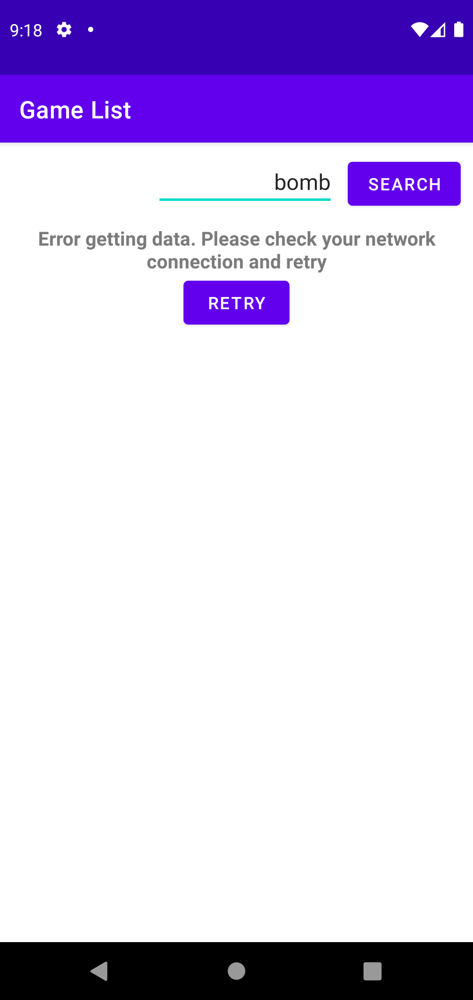

# GiantBombAPIDemo
## Screen1
#### Search game result and show them on recyclerview
### Loading

### Success

### Failure

## Screen2
#### Show game detail with description
  

#### You can find the api documentation on [https://www.giantbomb.com/api/documentation](https://www.giantbomb.com/api/documentation).